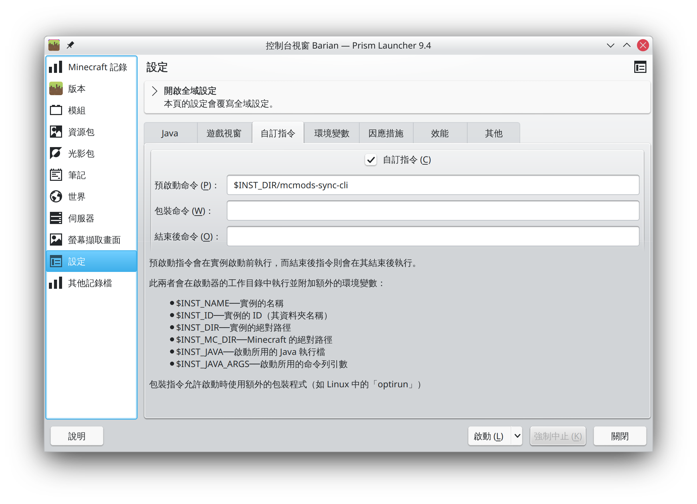
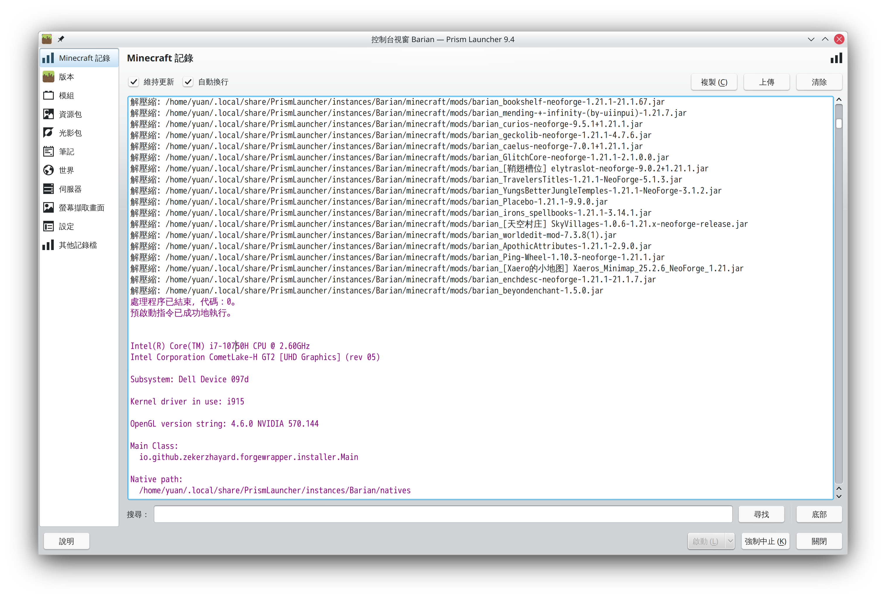

Minecraft模組同步工具
===

我們經營的伺服器為NeoForge模組伺服器，使用者必須安裝對應的模組才能連進我們的伺服器遊玩。考量我們伺服器對於模組需求的更動頻繁，故特別寫了這支小程式來減輕使用者每次都要手動下載檔案的麻煩。

這支同步更新程式需要搭配我們專用的http API後端伺服器使用，詳情請參考 <https://api-minecraft.yuaner.tw/docs/> ，將會用到以下API:
* GET /mods
* GET /files/mods/:file
* GET /zip/mods

## 本程式特點
### 兩種下載模式：zip整包下載模式、單檔下載模式
此程式有做兩種下載模式：ZIP下載、單一檔案一個個下載。

會比對客戶端已有的模組，如果客戶端和伺服器的模組檔案差距比較小，就只會下載缺漏的模組jar檔。如果客戶端和伺服器的模組檔案差距過大，要下載的檔案佔全部的70%以上，就會改走以ZIP模式一次下載一個全部整包以後，再自動解壓縮。（我這邊實測單檔一個個全部載完花費1m 58s，zip整包載完解壓縮完花費56s）

額外也有加上判斷，若伺服端的zip功能壞掉，則會fallback回退到單檔下載模式。

### 所有下載的檔名一律加上"barian_"開頭以方便區分
此程式只會掌管 `barian_*.jar` 的檔案，若是使用者自行安裝的模組，只要檔名不要是該前綴開頭就不會受到影響。

不過要注意！因為我們的伺服器有時候也會砍模組，也需要和使用者同步到，所以帶有 barian_ 開頭的檔案若伺服器那邊沒有，就會自動刪除。

### 盡可能讓大部分啟動器都支援
此工具會根據各個啟動器鎖提供的資訊來精準定位到正確的客戶端mods資料夾為置。
判斷Mods資料夾位置判定方式的優先順序為：
1. 手動參數 （手動直接指定 mods 資料夾位置）
2. --inst （由PCL Launcher傳入實例資料夾位置）
3. 環境變數 （由Prism Launcher傳入環境變數拿到實例資料夾位置）
4. 執行檔目錄判斷（裡面有 mods 資料夾 + 其他 Minecraft 實例特徵）

## 使用方法
會根據你是用什麼啟動器而有不同的方式。

基本上是掛在Prism Launcher / PCL Launcher啟動器的「預啟動命令」下，在啟動Minecraft主程式之前執行本程式，模組更新同步完成之後才會接續啟動Minecraft。

### 適用於 Prism Launcher 啟動器
可將主程式放置於任何地方，也可以與Minecraft資料夾放在一起。
本程式會依照Prism Launcher給的環境變數自動對應，不須額外手動指定參數。（不過有特殊情況還是可以手動指定，會以手動指定的參數為優先）

要將此工具副掛上去的步驟：

在Prism Launcher主畫面選擇你的實例以後，按下「編輯」，然後選擇左邊的「設定」→「自訂指令」


* 本例中，我是把這個小程式放到 `~/.local/share/PrismLauncher/instances/<實例名稱>/mcmods-sync-cli` ，所以預啟動命令那邊我是填 `
$INST_DIR/mcmods-sync-cli`
* 若你是放在`~/.local/share/PrismLauncher/instances/<實例名稱>/minecraft/mcmods-sync-cli` ，所以預啟動命令則是填 `
$INST_MC_DIR/mcmods-sync-cli`

設定好後，會先由這支小程式處理模組同步，處理完成隨即就會啟動遊戲了。


### 適用於 PCL Launcher 啟動器
TODO: 待補

### 手動獨立啟動本程式同步更新

你可以由 `--inst` 參數來設定這個遊戲資料夾位置
```
./mcmods-sync-cli --inst ~/.local/share/PrismLauncher/instances/<實例名稱>/minecraft
```

或是直接手動直接指定 mods 資料夾在哪裡
```
./mcmods-sync-cli ~/.local/share/PrismLauncher/instances/<實例名稱>/minecraft/mods
```

#### 將本程式與Minecraft資料夾放在一起

或是把執行檔放在遊戲資料夾內，然後直接執行，讓主程式自己判斷
```
./mcmods-sync-cli
```

## 從原始碼建置並執行
### 1. git clone 下來

### 2. 建置獨立環境
```
python -m venv .venv
source .venv/bin/activate
pip install -r requirements.txt
```
### 3. 啟動！參數帶入方式和上述 `mcmods-sync-cli` 一樣
```
python main.py --inst ~/.local/share/PrismLauncher/instances/<實例名稱>/minecraft
```

### 4. 打包成執行檔
```
pyinstaller --onefile main.py --name mcmods-sync-cli --paths ./src
```
